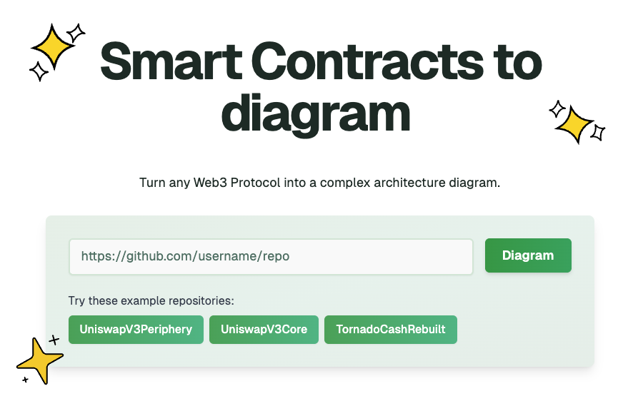

[](https://solidityVisualizer.com/)


[](https://ko-fi.com/VGabriel45)

# Solidity Visualizer

Visualize any Solidity project.

## ⚙️ Tech Stack

- **Frontend**: Next.js, TypeScript, Tailwind CSS, ShadCN
- **Backend**: FastAPI, Python, Server Actions
- **Database**: PostgreSQL (with Drizzle ORM)
- **AI**: OpenAI o3-mini, Claude 3.5 Sonnet
- **Deployment**: Vercel (Frontend), EC2 (Backend)
- **CI/CD**: GitHub Actions
- **Analytics**: PostHog, Api-Analytics

## 🤔 About

This project was created to help Solidity developers explore and understand Blockchain projects faster and better, personally I have been in the position where I need to understand a new project but quickly realized the codebase is too massive for me to dig through manually, not to mention that Solidity smart contracts are not always the easiest to understand.

Please follow the instructions to run this locally, this is a demo app and it is not deployed anyhwere yet.

## 🔒 How to diagram private repositories

You can simply click on "Private Repos" in the header and follow the instructions by providing a GitHub personal access token with the `repo` scope.

You can also self-host this app locally (backend separated as well!) with the steps below.

## 🛠️ Self-hosting / Local Development

1. Clone the repository

```bash
git clone https://github.com/VGabriel45/solidityVisualizer.git
cd solidityVisualizer
```

2. Install dependencies

```bash
pnpm i
```

3. Set up environment variables (create .env)

```bash
cp .env.example .env
```

Then edit the `.env` file with your Anthropic API key and optional GitHub personal access token.

4. Run backend

```bash
docker compose up --build -d
```

Logs available at `docker-compose logs -f`
The FastAPI server will be available at `localhost:8000`

5. Start local database

```bash
chmod +x start-database.sh
./start-database.sh
```

When prompted to generate a random password, input yes.
The Postgres database will start in a container at `localhost:5432`

6. Initialize the database schema

```bash
pnpm db:push
```

You can view and interact with the database using `pnpm db:studio`

7. Run Frontend

```bash
pnpm dev
```

You can now access the website at `localhost:3000` and edit the rate limits defined in `backend/app/routers/generate.py` in the generate function decorator.

## Contributing

Contributions are welcome! Please feel free to submit a Pull Request.

## Acknowledgements

Shoutout to [Romain Courtois](https://github.com/cyclotruc)'s [Gitingest](https://gitingest.com/) for inspiration and styling

## Support the Project

Solidity Visualizer is an open-source tool. If you find it useful for your work, consider supporting the ongoing development.

### Buy Me a Coffee

<a href='https://ko-fi.com/vgabriel45'></a>

### Crypto Donations
`0x373aa015cEeE5dca6740E5003433142894Bf5E0c`

### Other Ways to Support

- ⭐ Star this repository
- 🔀 Share with others who might find it useful
- 🐛 Report bugs and suggest features
- 💻 Contribute to the codebase

Your support helps make Solidity Visualizer better for everyone in the blockchain community! Thank you!